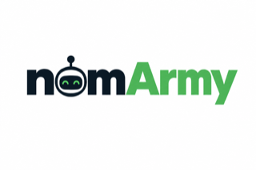

# nomArmy



[](https://github.com/rayson-tech/nomarmy/actions/workflows/ci.yml)
[](LICENSE)

> Tiny local coders, big appetites for bounded tickets. 🍪

**An agent harness where the worker's claims are never trusted, and the environment your tests need is declared, disposable and reproducible.**

A frontier coordinator (Claude Code, Codex) decides *what* should be built and whether the result is acceptable. A cheap worker (a *nom*) implements, tests and repairs, usually on a local model at zero token cost. nomArmy owns everything in between: worktrees, Git, environments, verification, and the evidence that decides whether work is accepted.

Developed and maintained by Rayson Technologies.

## New to local LLMs?

| Term | Meaning |
|---|---|
| **GGUF** | The file format `llama.cpp` loads a model from. |
| **Quantization** (e.g. `Q4_K_M`) | A compressed version of a model's weights: smaller/faster, some quality cost. `Q4_K_M` is nomArmy's default. |
| **Context window** | The total tokens a model can hold at once: prompt + reads + writes, one shared budget. |
| **llama.cpp / llama-server** | The engine nomArmy uses to run a local GGUF model over an OpenAI-compatible HTTP API. |
| **Sandbox** | An isolated Podman container a worker's tool calls run inside: no network, no host credentials. |
| **A "nom"** | One worker: a job dispatched to a local (or hosted) model in its own disposable Git worktree. |

## Install

| Platform | Guide |
|---|---|
| macOS (Apple Silicon) | [macOS](#macos-apple-silicon) |
| Linux (with or without an NVIDIA GPU) | [Linux](#linux) |
| Windows | [Windows](#windows) |
| NVIDIA DGX Spark | [DGX Spark](#dgx-spark) |
| No GPU / no local inference | [Cloud (Bedrock)](#cloud-bedrock) |

Every platform needs Git and Podman. `nomarmy doctor` checks host readiness and prints a fix for anything missing.

### macOS (Apple Silicon)

```bash
git clone https://github.com/rayson-tech/nomarmy.git
cd nomarmy
chmod +x install.sh e2e.sh scripts/*.sh
./install.sh --profile macbook-pro
./e2e.sh --profile macbook-pro
```

`install.sh` builds llama.cpp with Metal, installs/configures OpenClaw, starts the model, builds the sandbox, and registers the MCP server if Claude Code is present. Expect:

```text
PASS inference health
PASS model discovery
PASS worker report contract
PASS autonomous edit + verification
=== E2E PASS ===
```

Then copy this repo's `CLAUDE.md` into a real project, start Claude Code there, run `/mcp`, and delegate one small ticket before raising worker count.

If `e2e.sh` says `No API key found for provider "llama-cpp"`: `./scripts/configure-openclaw.sh macbook-pro`, then rerun `e2e.sh`.

### Linux

Installs the toolchain/CMake/Git/Node when missing. Install Podman yourself first (`apt`/`dnf`/`zypper`/`pacman`/`apk install podman`).

```bash
# no NVIDIA GPU
./install.sh --profile cpu-linux --no-claude && ./e2e.sh --profile cpu-linux

# with an NVIDIA GPU (not a DGX Spark -- see below)
./install.sh --profile nvidia-linux --no-claude && ./e2e.sh --profile nvidia-linux
```

CPU-only Linux works but is genuinely slow for interactive use: see [Speed matters more than fit](#speed-matters-more-than-fit).

### Windows

`install.sh` doesn't run natively. In order of preference:

1. **WSL2** (supported path): install a Linux distro under WSL2, install Podman inside it, run the [Linux](#linux) guide entirely inside the distro. Watch for WSL2's default ~50% RAM cap (`.wslconfig`) and `git config --global core.longpaths true` (`nomarmy doctor` checks this).
2. **Native Windows llama.cpp**, built from source: more RAM, more setup. Prebuilt binaries aren't a safe shortcut (some CPUs crash every backend at startup).
3. **Skip local inference**: `./install.sh --profile bedrock`, see [Cloud (Bedrock)](#cloud-bedrock).

Unsure which? `nomarmy sizing` reports what your hardware can actually support.

### DGX Spark

```bash
git clone https://github.com/rayson-tech/nomarmy.git
cd nomarmy
chmod +x install.sh e2e.sh scripts/*.sh
./install.sh --profile dgx-spark --no-claude
./e2e.sh --profile dgx-spark
```

Moving from a Mac install: don't copy a Mac binary or model cache over: clone fresh and let `install.sh` build CUDA-native llama.cpp on that host.

### Cloud (Bedrock)

No GPU, no local build:

```bash
export AWS_BEARER_TOKEN_BEDROCK=...   # or configure an AWS profile
./install.sh --profile bedrock
./e2e.sh --profile bedrock
```

Enable the models you intend to use in the Bedrock console first. `bedrock-cheap` runs the orchestrator on the same open-weight model as the workers: real savings, materially weaker guarantee (see `policies/reviewer.md`).

## Configuration

- **`config/common.env`**: defaults shared by every profile.
- **`config/profiles/<name>.env`**: per-machine overrides (context size, GPU layers, threads, workers).
- **A shell-exported variable** wins over both.

Every variable is documented next to itself in those two files: that's the source of truth.

| Variable | Lives in | Default | Controls |
|---|---|---|---|
| `NOMARMY_WORKER_MODEL` | common.env | `qwen3-coder-next` | Which model runs jobs |
| `NOMARMY_MODEL_REPO` / `_QUANT` | common.env | `Qwen/Qwen3-Coder-Next-GGUF` / `Q4_K_M` | Which GGUF to download |
| `NOMARMY_LLAMA_CONTEXT` | profile | `65536` | **Total** context across all slots |
| `NOMARMY_LLAMA_PARALLEL` | profile | `1` | Inference slots (context is divided across these) |
| `NOMARMY_MAX_WORKERS` | profile | `1` | Coordinator job concurrency |
| `NOMARMY_EXECUTION` | common.env | `local` | `local` or `bedrock` |
| `NOMARMY_ORCHESTRATOR_TRUST` | common.env | `frontier` | `frontier` or `degraded`: see `policies/reviewer.md` |

**The coupling that trips people up**: `NOMARMY_LLAMA_CONTEXT` is divided by `NOMARMY_LLAMA_PARALLEL`, not given to each slot whole: `65536` ÷ `2` slots = `32768` per nom. Size by context-per-nom and multiply up. See [Sizing noms](#sizing-noms).

A config change needs an inference restart: `nomarmy stop && nomarmy start`.

### Swapping models

```bash
nomarmy model
```

Offers three measured choices (Qwen3-Coder-Next, gpt-oss-20b, Qwen3.6-27B: see `docs/experiments/2026-09-20-model-bakeoff-and-economics.md`) or a Hugging Face search. Also offers to resync the MCP registration and restart inference in the same command: all three (config, registration, running process) need to agree, and it's easy for them to drift silently otherwise.

## Multi-provider dispatch pools

Optional: `config/providers.yml` adds named, weighted pools of *several* providers a job can dispatch against instead of the single global worker model: routine work stays local and free, harder work opts into a paid frontier one.

```bash
nomarmy providers add     # interactive wizard
nomarmy providers list
```

| Provider | Auth | Needs `base_url`? |
|---|---|---|
| `llama-cpp` | none (local server) | no |
| `anthropic` / `openai` / `xai` / `deepinfra` | native OpenClaw onboarding | no |
| `bedrock` / `azure-openai` / `openai-compatible` | custom endpoint | yes |

```yaml
# config/providers.yml
pools:
  cheap:
    - id: local
      provider: llama-cpp
      weight: 10
  capable:
    - id: anthropic-sonnet
      provider: anthropic
      model: claude-sonnet-4-6
      weight: 2
      auth_env: NOMARMY_ANTHROPIC_API_KEY
```

A pool entry never carries a raw credential, only `auth_env` (the name of an env var). Selection is weighted-random among currently-authenticated entries. Each entry gets its own `max_concurrent`; pool jobs get a separate concurrency ceiling (`NOMARMY_MAX_POOL_WORKERS`) additive to local workers. A hosted entry's context window is looked up from OpenClaw's own model catalog (with a safety margin), not a hand-maintained table: override with `context_window` for a model newer than that catalog knows. `thinking` on an entry can be a fixed level (`"high"`), not just true/false, when that tier should always reason hard regardless of what a job requests.

Dispatch with `local_worker`'s `pool` field (`pool: "cheap"`); omitting it keeps today's `profile`-only behavior unchanged.

**Honest gaps**: `worker_cost_usd` in job metrics is best-effort, not authoritative. `anthropic`/`openai`/`xai`/`deepinfra`'s native onboarding is built from documented `--help` output and isn't verified against a real credential for every one: `nomarmy providers add` says so and points at `openclaw models list` to confirm.

**Picking a tier**: `cheap` (local) for a bounded change against a written spec with a test. `capable` (hosted) when the design is settled but needs real comprehension the brief doesn't quote. No pool, frontier coordinator, when the answer isn't known yet or spans several files. `cheap` never leaves your machine; `capable` sends code to a third party: that's a decision about where source travels, separate from the trust boundary.

## The `nomarmy` CLI

Not published to npm (`"private": true`): clone and `npm install && npm link` (done for you by `install.sh`), or run commands directly: `node bin/nomarmy.mjs doctor`.

Every command proposes before writing anything: explicit `[y/N]` confirmation, or an explicit flag standing in for one under `--json`. None touch system-level infrastructure; `install.sh` stays a separate, manual step.

| Command | What it does |
|---|---|
| `nomarmy doctor` | Host readiness, with a fix for anything missing. Start here. |
| `nomarmy setup` | Detect the machine, recommend a profile, choose a model, write config. Prints (never runs) `install.sh`. |
| `nomarmy init` | Propose `.nomarmy.yml` from scan evidence. |
| `nomarmy model` | Change the model later. See [Swapping models](#swapping-models). |
| `nomarmy providers list/add/update/remove/validate` | Manage `config/providers.yml`. See [above](#multi-provider-dispatch-pools). |
| `nomarmy update` | Pull latest (fast-forward only) and resync the installed MCP copy. |
| `nomarmy connect [claude] [cursor] [codex]` | (Re-)register the MCP server. No target: interactive multi-select. |
| `nomarmy start` / `stop` | Start/stop local inference. |
| `nomarmy uninstall` | Remove MCP registration + install dir. `--clear-agents`/`--clear-models`/`--all` for deeper cleanup. |
| `nomarmy sizing` | Recommend context/slot/worker counts from hardware + model metadata. `--check` evaluates the loaded profile; `--noms N` sizes for an exact count. |
| `nomarmy scan` | Report a repo's execution environment from deterministic evidence. `--check` diffs against a committed `.nomarmy.yml`. |
| `nomarmy validate` | Validate `.nomarmy.yml` against the schema. |

All commands take `--json` and `--repo <dir>`.

## Sizing noms

Three coupled knobs: `NOMARMY_LLAMA_CONTEXT` (`-c`, total context), `NOMARMY_LLAMA_PARALLEL` (`-np`, slots), `NOMARMY_MAX_WORKERS` (coordinator concurrency). `nomarmy sizing` inspects hardware + the model's GGUF metadata and recommends a combination, checking live memory pressure too.

Target: 64K context per nom: an autonomous explore/implement/test/repair loop needs more room than a one-shot edit. `nomarmy sizing`/`setup` show **More noms** (max that fits) vs **Nominal** (1 nom, what every shipped profile actually uses) when they differ; raising worker count is an empirical question, not a capacity one: measure accepted-tickets/hour before assuming more is faster (on one tested Apple Silicon machine, going from 1 to 4 parallel workers produced *zero* net throughput gain).

### Speed matters more than fit

CPU-only hardware: measured ~3.8 tok/s generation on a 20-core i7, no GPU (gpt-oss-20b MXFP4): an 11.5-minute job for two assistant turns. Turn count dominates over token count on slow hardware; a tighter objective is worth more than a bigger context window. **Rule of thumb: GPU or a hosted profile for interactive work**; CPU-only is a correctness testbed, not something to depend on.

Advanced llama-server tuning (`NOMARMY_LLAMA_CACHE_TYPE_K/V`, `_FLASH_ATTN`, `_REASONING_BUDGET`, `_REASONING_PRESERVE`, `_EXTRA_ARGS`) is documented inline in `config/profiles/*.env`; unset by default, none validated by nomArmy.

## Starting/stopping inference

```bash
nomarmy start   # or: ./scripts/start-inference.sh <profile>
nomarmy stop
```

Logs land under `$HOME/.local/share/nomarmy-local-agents/logs/`.

## Target repository languages

| Language | Detection | Sandbox toolchain |
|---|---|---|
| Node | `package.json` | Built into the base image |
| Python (runtime only) | `pyproject.toml` | Built into the base image |
| Go / Rust | `go.mod` / `Cargo.toml` | Built lazily, on first use, cached after |
| Python (with dependencies) | `requirements.txt`, or `environment.python.requirements` in `.nomarmy.yml` | Built lazily per repo, keyed on dependency content |

```yaml
environment:
  python:
    requirements:
      - requirements-dev.txt
      - lambda/requirements.txt
```

A worker's own tool calls (not just nomArmy's verification step) get the same resolved sandbox image automatically. `NOMARMY_AGENT_IMAGE` always overrides auto-detection.

### Scoping verification to the diff

A verification command scoped by a hand-maintained keyword filter (`pytest -k`) can silently exclude the file a worker actually changed: the same failure mode `verify_regression`/`testSelectionRisk` exist to catch. nomArmy exposes what the diff touched as two env vars inside the sandbox, language-agnostically:

| Variable | Contents |
|---|---|
| `NOMARMY_CHANGED_TEST_FILES` | New + modified test files, space-separated |
| `NOMARMY_CHANGED_PRODUCTION_FILES` | Non-test files touched, space-separated |

Both are always present (empty when nothing applies); a command that never references them is unaffected.

```yaml
verification:
  python:
    commands:
      - 'if [ -n "$NOMARMY_CHANGED_TEST_FILES" ]; then python3 -m pytest $NOMARMY_CHANGED_TEST_FILES -q; fi'
      - 'if [ -n "$NOMARMY_CHANGED_PRODUCTION_FILES" ]; then python3 -m pytest lambda/tests/ -k "gx or descriptor" -q; fi'
```

Run the narrow, touched-files pass for a fast/sharp signal *and* the broad pass whenever production changed: never one instead of the other; a shared module can have far more dependents than whichever file the diff happened to touch. Use `if`/`fi`, not `A && B || C` (a failing `B` there falls through to `C`'s exit code: a real false-pass bug caught in this project's own docs). For the *cost* of running the broad sweep twice under `verify_regression`, parallelism (`pytest-xdist -n auto`) beats scoping, since it doesn't trade away coverage.

### Catching a new function wired to nothing

A worker can introduce a new function/class that nothing outside its own test calls: built, never wired in. nomArmy finds definitions genuinely new in a diff (line-level, so a file full of already-used helpers doesn't flood this with noise) and flags any with zero non-test references anywhere in the repo. Heuristic and review-only, never a block: a dynamically-dispatched caller can look like this too.

## Other coordinators: Codex and Cursor

```bash
nomarmy connect claude codex cursor   # any subset
nomarmy connect                       # interactive multi-select
```

Codex reads `AGENTS.md`; Cursor's registration is a JSON file nomArmy edits directly. Each target is attempted independently. `nomarmy update` resyncs whichever are already connected.

## How nomArmy works (and why)

**Worker output is a claim. Repository and environment state are evidence.** The worker never runs Git, can't commit or mark its own work accepted, and writes a four-line report nomArmy checks against the repository rather than trusting. A malformed report isn't automatically a failure; if the repository changed, nomArmy verifies independently and may recover it. But **failing verification stays failed**, unconditionally.

**The economics**: use scarce frontier intelligence for intent and judgment, abundant worker intelligence for implementation and repair. Measured so far (`docs/experiments/2026-09-20-model-bakeoff-and-economics.md`): it depends on task size, not model choice. Small, precisely-diagnosed fixes lose to doing them yourself; delegation pays off when the surrounding context needed is meaningfully larger than the fix itself. A same-ticket comparison against a hosted model put local at $0/62s vs. ~$0.05-0.07/51s, real at scale but not proven as a universal curve. Local also means the model behind the seat can improve with your hardware, with nothing else in the harness changing.

A sharp corollary from real use: writing the coordinator's `evidence` field thoroughly enough to hand a worker every fact it needs *is* the diagnosis. If what's left after that is a small, mechanical change, you already paid the cost delegation exists to save, and the fix has quietly become the losing shape above. A ticket that's part diagnosed-fix and part bulk, mechanically-verified work (writing a batch of tests, say) usually splits better than it delegates whole: keep the fix, hand off only the part that's genuinely nom-shaped.

A second pattern, same session: the cheap tier is worst exactly where the test harness is the hard part, not the change itself. Hand it something a worker can just type, a validation rule with a passing and failing case, and it does well. Hand it code with no existing way to verify it, and that's what both timeouts and inert tests came from that night: it burned its budget hunting for a harness that didn't exist instead of writing the change.

**Scouts and decomposers** are read-only noms for research and planning: every claim carries a `[path:start-end]` citation, resolved against the exact base commit through Git, never the worktree. Most scout-shaped questions ("where is X defined") aren't questions for a model at all: `repo_evidence` answers them deterministically in milliseconds; reach for a nom only for what that can't answer.

**A concrete result**: a local 20B worker was asked to add a `doctor` command with tests. It produced 156 lines that read as competent (JSDoc throughout, clean structure) with six real defects invisible without executing it, including a file that didn't even parse and a "no test file" gap despite an explicit acceptance criterion. nomArmy committed nothing; the record showed `tests added: 0`, from the repository, not the worker's claim. That's the whole argument: reading the diff would have plausibly approved it; executing it didn't.

## Status

Bounded-delegation core is proven: coordinator-owned Git, isolated worktrees, retained failed worktrees. This release (`0.1.0-alpha`) extends toward autonomous workers with real execution environments: still in development.

| Capability | Status |
|---|---|
| Bounded delegation, coordinator-owned Git, retained worktrees | Working, E2E tested |
| Local (llama.cpp) and Amazon Bedrock execution profiles | Working |
| `nomarmy doctor` | Working, verified on a real host |
| Scout / decompose modes | Built, unit + live tested |
| `auto_union`, `verify_regression`, independent verification | Built, unit tested. `verify_regression` defaults ON whenever `verification` is set |
| Scoped test-selection risk / unwired-definition checks | Built, unit + live tested. Heuristic, review-only |
| Secret scanning (secretlint-backed, hard block) | Built, unit tested against the real dependency. Known secret shapes only, not steered content |
| `.nomarmy.yml` environment contract | Built, unit tested |
| Disposable per-job service environments (Postgres, mocks) | Not built |
| Nom-local browser/E2E, autonomous repair loop | Not built |
| Full-stack thesis test | 7 tickets across 3 local models: task-size-dependent, not unconditionally true. A separate single-night, single-codebase run of 7 cheap-tier jobs scored 2 clean, 4 needing correction (mostly the inert-test defect `verify_regression`/`testSelectionRisk` now catch automatically), 2 timeouts on functions with no existing test harness. Read-only scout delegation was the more consistent win that same night: 5 surveys changed real decisions on ~520k tokens the coordinator never had to read itself |
| Swapping the active local model | Working |
| Go/Rust target repos | Verification live-verified; worker's own tool execution uses one global sandbox config |
| Multi-provider dispatch pools | Live-verified for `llama-cpp` and `xai`; other native providers unverified against real credentials |

Known limitations: verification profiles needing services beyond `environment: none` report `not_run` rather than executing without them; the environment scanner's Compose parser doesn't resolve YAML anchors/aliases.

## The MCP tools

Every job takes the same shape: a `task`, optional `acceptance`, a `mode`, a timeout.

| Tool | What it does |
|---|---|
| `local_worker` | Run one job and wait. |
| `local_worker_start` / `local_worker_status` | Start in the background / poll for the result. |
| `local_worker_capacity` | Context, budgets, memory pressure, what's running. Read-only. |
| `repo_evidence` | Deterministic evidence (definitions, references, outline, grep, files), `[path:line]` on every hit, no model. |
| `local_workers` | Run a batch with bounded parallelism. `auto_union: true` merges independent jobs into one integration branch for review. |
| `local_worker_jobs` | Recent job records: compact projection by default, `full: true` for the complete manifest. |
| `local_worker_cleanup` | Remove one worktree/branch. Recognizes a cherry-picked branch as integrated by content, not just ancestry. |
| `local_worker_sweep` | Bulk-reap worktrees that are provably empty (zero commits, nothing uncommitted), any age. `dry_run` previews. |
| `local_worker_config` | Surface `.nomarmy.yml`'s verification profiles. |

**Admission**: context-per-nom bounds brief/report size; free memory bounds whether a new job starts at all.

## Security posture

The worker gets a writable worktree inside Podman and nothing else: no socket, no host credentials, no network. Repository content is untrusted input; `.nomarmy.yml` is data to validate, never authority.

**Never hand the coder** AWS/production credentials, deployment access, SSH keys, Kubernetes contexts, or Terraform state.

On Bedrock profiles, the model call is made by the host-side OpenClaw process, never from inside the sandbox, which stays `network: none` regardless. What changes on a cloud profile is data flow (repository content leaves the machine), not sandbox reach.

Every diff and worker report is scanned for known secret shapes (secretlint's recommended preset: AWS, GitHub, Slack, Stripe, OpenAI/Anthropic, npm, private keys, and more) before a commit is allowed; a match blocks it. This catches known shapes, not adversarially steered content with no recognizable shape: see `SECURITY.md`.

## Troubleshooting

| Symptom | Fix |
|---|---|
| `No API key found for provider "llama-cpp"` during `e2e.sh` | `./scripts/configure-openclaw.sh <profile>`, rerun. |
| `git worktree add` fails with `Filename too long` (Windows/WSL2) | `git config --global core.longpaths true`. |
| A config change didn't take effect | `nomarmy stop && nomarmy start`. |
| Verification always fails on a missing package | See `resolveNodeModulesMount` in `lib/verify.mjs` for Node's read-only `node_modules` mount. |
| Not sure a setting fits your hardware | `nomarmy sizing`, or `--check` against a loaded profile. |
| General "is this host ready" | `nomarmy doctor`. |

## Other notes

nomArmy is a same-host worker/coordinator stack today: MCP and OpenClaw run on the same machine. A centralized/remote-worker release doesn't exist yet.

Config vars are `NOMARMY_*`; a legacy `RAYSON_*` export is translated once at load with a deprecation warning.
